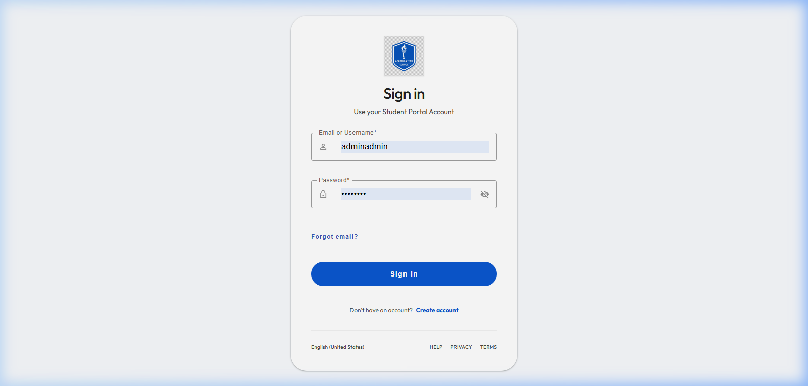
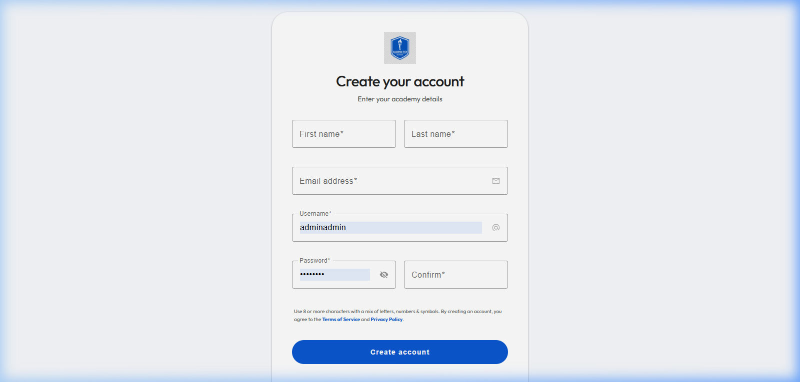
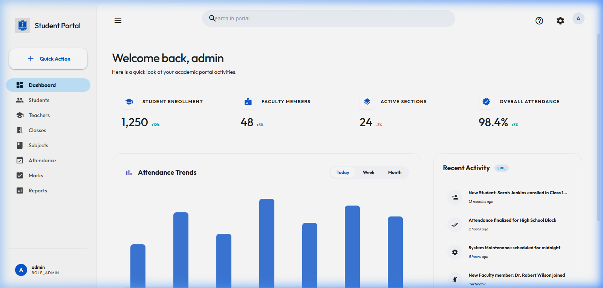
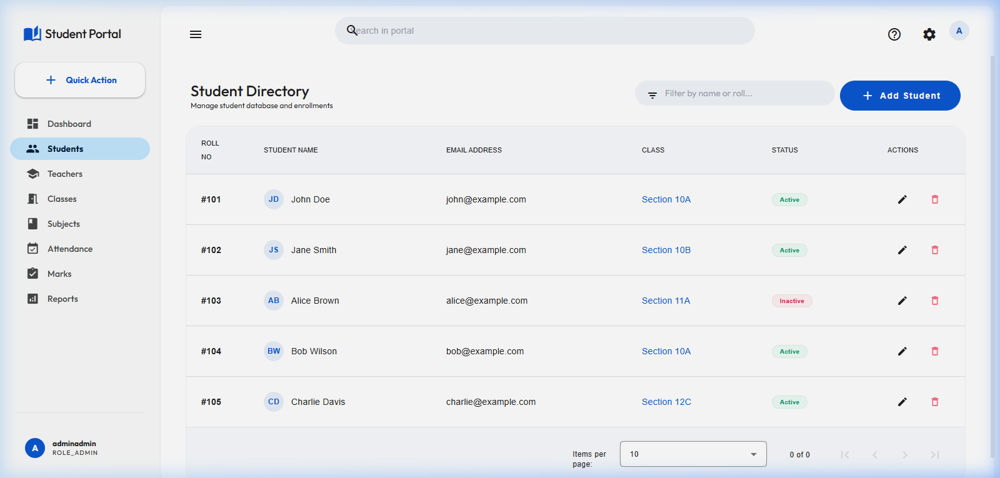
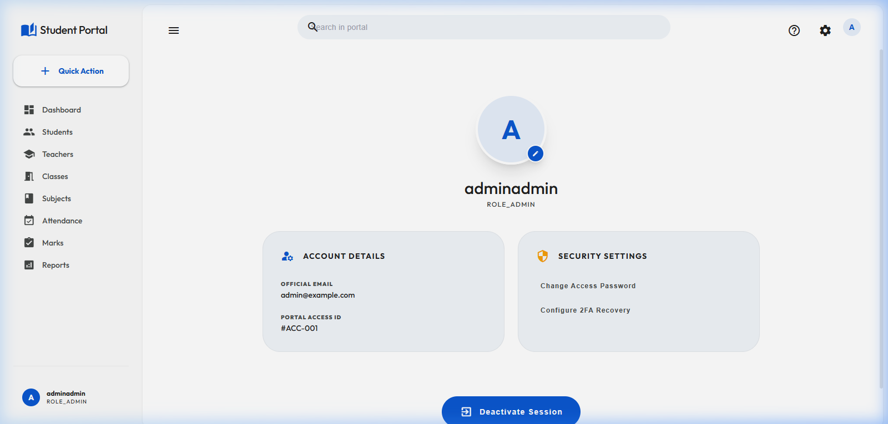

# Student Management System - Google Material 3 Edition


A comprehensive, world-class Student Management Portal redesigned with **Google Material 3** principles. Inspired by the productivity and clarity of **Gmail** and **Google Drive**, this system offers a professional, light-themed experience for managing academic activities.

## 🚀 Key Features

- **Google Material 3 UI**: Clean, light surfaces with Gmail-inspired pill navigation and Drive-style search.
- **Dynamic Dashboard**: "Bento-style" metrics cards and a real-time activity feed.
- **Branded Authentication**: Redesigned Login and Register pages with custom branding and secure flows.
- **Student Management**: Full-featured directory with M3 data tables and filtering.
- **Teacher Profiles**: Professional profile cards for faculty members.
- **Academic Suite**: Integrated modules for Attendance, Marks, Reports, and Subjects.
- **Responsive Design**: Fluid layout that adapts across desktop and tablet views.

## 📸 Screenshots

### Branded Authentication
| Login Page | Register Page |
| :---: | :---: |
|  |  |

### Dashboard & Analytics


### Student Directory & Profiles
| Student List | Profile Management |
| :---: | :---: |
|  |  |

## 🛠 Tech Stack

- **Frontend**: Angular 19, Tailwind CSS v3, Angular Material v19
- **Backend**: Spring Boot 3, Spring Security (JWT)
- **Database**: MySQL
- **Design Language**: Google Material Design 3

## ⚙️ Installation & Setup

### Frontend Setup
1. Navigate to the `frontend` directory.
2. Install dependencies:
   ```bash
   npm install
   ```
3. Run the development server:
   ```bash
   npm run start
   ```
4. Access the portal at `http://localhost:5000`.

### Backend Setup
1. Navigate to the `backend` directory.
2. Configure your MySQL database in `src/main/resources/application.properties`.
3. Build and run the Spring Boot application using Maven:
   ```bash
   mvn spring-boot:run
   ```

## 🤝 Contributing
Feel free to fork this project, open issues, and submit pull requests to help improve the Student Portal!

---
**Developed with ❤️ by Ahsan Ali**
